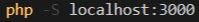
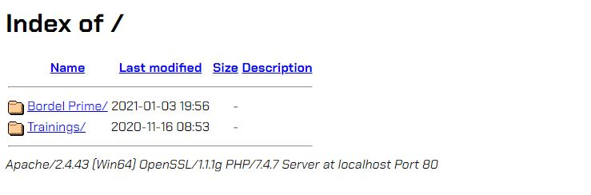

# Projet : Tweet Academy
___
### Objectif :
Développer un réseau social en 4 semaines ( Avec un autre projet de 2 semaines en parallèle ).
Ce projet devra ressembler ( en terme de fonctionnalités ) au réseau social : **Twitter**.
### Restriction :
La base de données du projet devra être une base de données commune à tous les groupes et mise au point par tous les groupes.
___
# Fonctionnalités :
### Fonctionnalités de base :
- *( Done )* Il doit être possible de se créer un **Compte**.
- *( Done )* Il doit être possible de se **Connecter** à son **Compte**.
- *( Done )* Il doit être possible d'envoyer des **Tweets**.
- *( Done )* Il doit être possible de créer des **Hashtags** à partir des **Tweets** envoyés.
- *( Done )* Il doit être possible de **Mentionner** des gens à partir des **Tweets** envoyés.
- *( Done )* Il doit être possible de **Répondre** à un **Tweet**.
- *( Done )* Il doit être possible de **Retweeter**.
- *( Done )* Il doit être possible de faire une **Recherche** de **Tweets** par **Hashtag**.
- *( Done )* Il doit être possible de **Follow** un autre membre.
- *( Done )* Il doit être possible de **Unfollow** un autre membre.
- *( Done )* Il doit être possible de changer de **Thème** ( **Sombre** / **Clair** ).
- *( Done )* Il doit être possible de visualiser la liste des **Followers**.
- *( Done )* Il doit être possible de visualiser la liste des **Followings**.
- *( Done )* Il doit être possible de rafraîchir la **Timeline** automatiquement.
- *( Done )* Il doit être possible de modifier son **Profil**.
- *( Done )* Il doit être possible d'envoyer des **Messages Privés**.
- *( Done )* Il doit être impossible d'envoyer des **Tweet**s dont le contenu dépasse les **140 Caractères**.
### Détails Techniques :
- *( Done )* Les **Passwords** doivent être **Hash** au format **RIPEMD160** avec le **Salt** suivant : **vive le projet tweet_academy**.
- *( Done )* Il doit être possible de **Rechercher** des utilisateurs aussi ( en plus des **Hashtags** ).
- *( Done )* Les **Mentions** et **Hashtags** doivent être des liens qui pointent vers le **Profil** mentionné ou les **Tweets**.
- *( Done )* Il doit être possible d'afficher une **Suggestion** de **Profils** à chaque caractère tapé lors du **Tweet**.
- *( Done )* Il doit être possible d'ajouter des **Images** aux **Tweets** et réduire la longueur de l'url pointant vers l'image en question.
___
# Équipe :
Ci-dessous, l'équipe en charge du projet.
### Matrix Team :
- *Morpheus* : [Alexis Gueudre](https://www.linkedin.com/in/alexis-gueudre/)
- *Neo* : [Amine Belkheiri](https://www.linkedin.com/in/amine-belkheiri/)
- *Trinity* : [Ophélie Diomar](https://www.linkedin.com/in/ophelie-diomar-680162209/)
- *Niobe* : [Fatoumata Gandega](https://www.linkedin.com/in/fatoumata-g/)
___
# How To :
Suivez bien les étapes ci-dessous !
### Étape 1 :
- Pour pouvoir profiter de notre projet, vous devrez créer une base de données nommée **common-database**.
- Ensuite, il vous faudra importer le fichier **common-database.sql** dans la base données créée précédemment.
### Étape 2 :
- Clonez ensuite le repository dans votre dossier **/htdocs** ou **/www** ( en général ).
- Le dossier peut varier en fonction de si vous utilisez **MAMP**, **WAMP**, **LAMPP** ou **XAMPP**.
- Si vous n'utilisez aucun des éléments cités ci-dessus, renseignez-vous sur la commande de l'**Étape 2.1**.
- Si vous utilisez un des éléments cités ci-dessus, passez directement à l'**Étape 3**.
### Étape 2.1 :

### Étape 3 :
- À présent, démarrez **Apache** et **MySQL** puis rendez-vous dans votre **localhost/**.
- Pour profiter du site, vous devrez créer un fichier php dans le dossier **mvc/models/** que vous nommerez **Database.php**.
### Étape 3.1 :
- Collez à présent le code ci-dessous dans le fichier **Database.php** que vous avez créé précédemment.
- Pensez à modifier vos identifiants de connexion à **MySQL** dans l'instance **PDO** si les vôtres diffèrent.
```php
<?php
    class Database {
        protected $database = null;
        private function __construct() {}
        protected function connectDatabase() {
            if(is_null($this->database)) {
                try {
                    $this->database = new PDO('mysql:host=localhost;dbname=common-database', 'root', '');
                    return $this->database;
                } catch (PDOException $e) {
                    die("Erreur : " . $e->getMessage());
                };
            };
        }
    }
?>
```
### Étape 4 :
- Si vous êtes partisans de l'**Étape 2.1**, rendez-vous à l'url suivante dans votre navigateur :
```
http://localhost:3000/
```
- Sinon rendez-vous à l'url suivante :
```
http://localhost/
```
### Étape 5 :
- Quelque chose tel que ceci devrait à présent apparaître sous vos yeux ( Avec plus ou moins de liens ) :

- Cliquez sur le lien ayant le même nom que le repository que vous avez cloné précédemment.
### Étape 6 :
- Vous pouvez à présent profiter pleinement du projet !
___
<footer style="display: flex; justify-content: center; align-items: center; width: 100%;">
    <p>Powered by - <span style="color: #009FFC;">Matrix Team</span></p>
</footer>